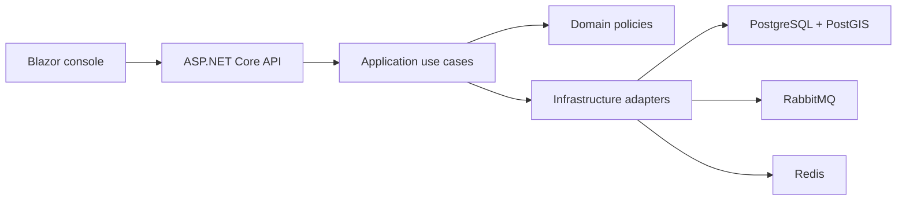

<div align="center">

<h1>♿ AccessRoute</h1>

<p><strong>Accessible transit and paratransit coordination for riders, operators, and caregivers.</strong></p>

     

<p>
  <a href="#features">Features</a> •
  <a href="#technology-stack">Technology</a> •
  <a href="#local-setup">Setup</a> •
  <a href="#contributing">Contributing</a>
</p>

</div>

---

## Overview

AccessRoute coordinates accessible public transport and paratransit journeys for riders with mobility, sensory, and assistance needs. The solution models riders, caregivers, drivers, qualified vehicles, recurring bookings, dispatch assignments, service alerts, and operational audit events.

The codebase follows a layered .NET architecture: domain rules remain independent, application services orchestrate use cases, infrastructure adapters connect external systems, the API exposes operational endpoints, and a Blazor WebAssembly console supports dispatch teams.

## Features

- Accessible rider profiles, saved places, caregivers, and mobility-aid requirements
- One-time and recurring trip requests with time-window validation
- Rider-to-vehicle compatibility and driver qualification checks
- Fare, cancellation, no-show, detour, capacity, and shift policies
- Dispatch assignment, pickup sequencing, transfers, and service-zone matching
- Emergency prioritisation and service-alert workflows
- Redis-backed idempotency and durable outbox/event publishing
- PostGIS-ready spatial queries and OpenTelemetry instrumentation
- Accessible Blazor operations dashboard
- Automated domain and policy tests

## Architecture



## Technology stack

| Area | Technology |
| --- | --- |
| Runtime | .NET 9 and C# |
| API | ASP.NET Core minimal APIs |
| Web | Blazor WebAssembly |
| Coordination | Orleans virtual actors |
| Database | PostgreSQL 16 with PostGIS |
| Messaging | RabbitMQ |
| Cache and idempotency | Redis |
| Observability | OpenTelemetry |
| Local infrastructure | Docker Compose |
| Tests | xUnit-based .NET test project |

## Repository structure

```text
src/
├── MobilityBridge.Domain/          # Entities, value objects, and policies
├── MobilityBridge.Application/     # Ports and use-case services
├── MobilityBridge.Infrastructure/  # Persistence, actors, messaging, telemetry
├── MobilityBridge.Api/             # HTTP endpoints and composition root
└── MobilityBridge.Web/             # Accessible Blazor operations console
tests/MobilityBridge.Tests/          # Domain and application tests
migrations/                          # Database evolution
docs/                               # Architecture and merge guidance
```

## Prerequisites

- Git
- .NET SDK 9
- Docker with Docker Compose
- An optional OTLP-compatible telemetry backend

## Local setup

### 1. Clone

```bash
git clone https://github.com/deepakvish001/MobilityBridge.git AccessRoute
cd AccessRoute
```

### 2. Configure

```bash
cp .env.example .env
```

Replace the sample JWT secret before using any shared environment. The default database, Redis, RabbitMQ, and telemetry values are suitable for local containers.

### 3. Start infrastructure

```bash
docker compose up -d
docker compose ps
```

RabbitMQ management is exposed on `http://localhost:15672`. PostgreSQL, Redis, RabbitMQ AMQP, and OTLP use the ports declared in `docker-compose.yml`.

### 4. Restore and build

```bash
dotnet restore MobilityBridge.sln
dotnet build MobilityBridge.sln
```

### 5. Run the API

```bash
dotnet run --project src/MobilityBridge.Api
```

Use the URL printed by ASP.NET Core. Health endpoints are available at `/health/live` and `/health/ready`; OpenAPI is mapped by the API project.

### 6. Run the web console

In another terminal:

```bash
dotnet run --project src/MobilityBridge.Web
```

## Tests

```bash
dotnet test MobilityBridge.sln
```

The suite covers fares, capacity, compatibility, detours, idempotency, pagination, recurring trips, redaction, route costs, shifts, and time windows.

## Configuration and security

- Keep real secrets out of source control.
- Use a JWT secret of at least 32 random characters.
- Restrict CORS and infrastructure ports outside local development.
- Use tenant context, permission evaluation, rate limiting, and secret redaction at trust boundaries.
- Preserve idempotency keys and outbox handling for retryable operations.
- Export telemetry without recording tokens or sensitive rider data.

## Contributing

Create a focused branch, include tests for policy changes, and document new environment variables or operational dependencies. Keep domain rules independent from infrastructure concerns and ensure accessibility remains part of the definition of done.
